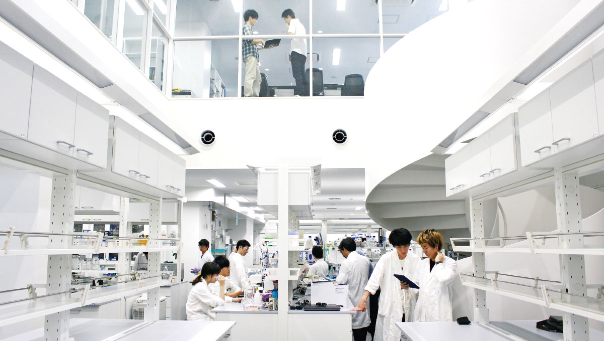

##  Nagoya Connect
2022/08/27

---

## 自己紹介

--

- 澤田桂都
- 名古屋大学 情報学部 コンピュータ科学科 B4 {.fragment .fade-up}
- 趣味 {.fragment .fade-up}
  - ソフトウェア開発
  - 音楽(ピアノ&軽音)
  - 空手
- その他 {.fragment .fade-up}
  - 3歳児のような好奇心を発揮する
  - たくさん寝る

--

### 意識していること

- 「大学生の間の有り余る程の時間を、如何にお金と経験に変換するかを考えなさい」
- 少しでも心が惹かれたら、とりあえずやってみる

---

## バックグラウンド

---

### 高校2年生

--

- 秋に、伊丹健一郎先生(名大・有機化学)が高校に講演に来る
  - 「おしゃれな建物なので、是非見学に遊びに来てください」
  - 友人に誘われて研究室を訪問

<ul style="display: flex;">
    <li style="list-style: none;"></li>
    <li style="list-style: none;"></li>
</ul>

---

### 高校3年

--

- 志望校を考える
  - 「名大に、音楽をパソコンで解析したりする研究をしている戸田先生という人がいるらしい」
- 自習室カフェ(地域の中高生の憩いの?場)で多くの人と教え合いながら受験勉強

---

### 大学1年

--

- 戸田先生の研究室を訪問
    - 「戸田先生のホームページで紹介されていた音楽情報処理の研究に興味を持ちました。研究内容について伺ったり、研究室の様子を見学させて頂けますか？」
      - ほぼメールの原文ママ抜粋
    - 「大学院生を指導役につけるから、研究室の勉強会の教材をやってみるかい？」
- 学科でプログラミングの勉強会を開いた

---

### 大学2年

--

- コロナで大学がオンライン化
- 「せっかく家に籠もってるんだし、プログラミングのスキルを伸ばす時間って捉えるか」
  - 自分用の便利ツールを色々と開発

---

## 〜そして伝説?へ〜

---

### 大学3年

--

- ピアノサークルの知人(D1)「澤田くん、音楽関係のプログラミングを勉強してたよね？その知識とスキルをウチでやってる研究開発で活かしてくれない？」
    - DII協働プログラム(修士&博士過程の5年一貫の教育プログラム)の一部に参加
    - 名大医学部との共同研究
    - ビジネス化に向けた製品開発

--

- 講義中の戸田先生「名大では新しい学内向けシステムを開発しようとしていて、もし開発に興味ある人がいたらぜひ連絡してくださいね〜」
    - 講義終了後「興味あります」
        - 22/01に新規サービスとして運用開始
        - 現在は開発チームのマネジメント業

--

- 別の先生「VR関係の開発を手伝ってくれる人を探していて、興味あれば連絡してください」
    - 講義終了後「興味あります(メール)」
        - (企業秘密♡)

---

### 大学4年

これまでの成果が目に見え始めた頃

--

- 軽音サークルの知人(M2→卒業)「君のソフトウェア開発のスキルを、ぜひウチのベンチャーで活かして開発を手伝ってくれない？」
    - 「あー良いですよ」
    - 名大の研究室初ベンチャーで勤務開始
        - ある開発部門を主導
- 戸田研究室に配属
  - ゴリゴリ研究

---

## まとめると

- ピアノ x コンピュータ を深め {.fragment .fade-up}
- 自分がやってることを色々な人に喋り、今どんなことをやっているのか聞き {.fragment .fade-up}
- 舞い込んできた話に飛びついた {.fragment .fade-up}

---

## 伝えたいこと

- 「挑戦しよう」なんて思わなくていい {.fragment .fade-up}
- 好きなこと＆興味のあることをどんどん学び、深めよう  {.fragment .fade-up}
    - 行動の土台になる
- 色々な人と話そう {.fragment .fade-up}
    - アウトプット is 大事
    - 行動のキッカケになる
- チャンスをすべて拾おう {.fragment .fade-up}
    - 一期一会
- ただし、休む時間は確保しよう {.fragment .fade-up}
    - いちばん大事

---
